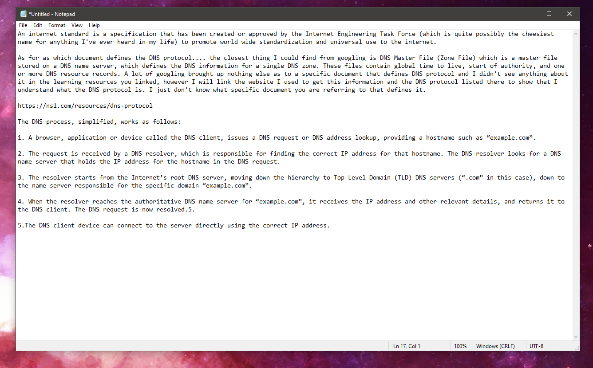
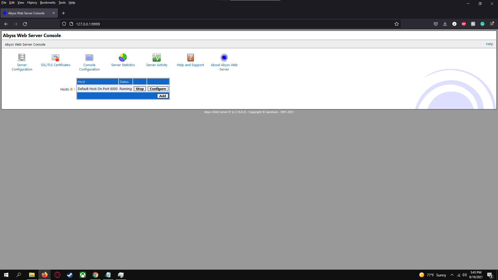

Feel pretty confident about everything this assignment accept one or two of the nslookup commands that I just couldn't seem to figure out entirely. That and some of the chrome dev tools excercises but you said last class to just try our best on those.

